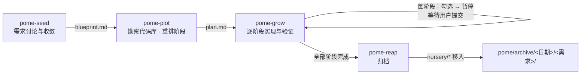

# pome

> **pome**（石榴）—— 石榴籽本就是种子，果实落地不是结束，而是下一次生长的开始。pome 以同样的心意组织 AI 辅助开发：把流程凝结成一粒粒独立可复用的 skill，走完一轮「播种 → 规划 → 生长 → 收割」，再为新需求的到来腾出苗圃。

## 为什么需要 pome

pome 针对超复杂任务设计：需求涉及多模块、多阶段、需要反复对齐共识时才值得走完整流程。

- **简单任务**（改个 bug、加个小函数、一次能说清的小改动）：不需要使用这些技能，直接让 AI 动手即可。
- **不太复杂的任务**：不需要全流程。用 pome-seed 设计方案后，拿到收敛的 blueprint.md 直接让 AI 开发即可，无需 Plot 和 Grow。
- **超复杂任务**：走完 Seed -> Plot -> Grow -> Reap 完整生命周期。

超复杂任务在 AI 协作中通常面临这些问题：

- **决策散落在聊天记录里** —— AI 协作中拍板过的共识换个会话就没影。Seed 把每次决策即时落盘成 `blueprint.md` 这份唯一事实源。
- **一大坨改动没法验收** —— 一次性生成的大改动难以逐步确认、出问题只能整体回退。Plot 把需求切成依赖递进的阶段，每个阶段都能独立验收、提交和回退。
- **进度说不清做到哪了** —— `plan.md` 的复选框是唯一进度来源，只随真实验证结果更新，不存在第二本账。
- **流程靠人肉推动** —— 四个 skill 各守一段工序，前置检查与回退路径内建：出问题时明确告诉你该回到哪一步。

## 工作流总览



图之外还有隐式回退边：Grow 发现阶段结构无法覆盖方案时返回 Plot，发现功能方案需要修改时返回 Seed；plan 只写稳定边界，文件路径与命令由 Grow 按代码库现状决定。

## Skills 一览

| Skill | 职责 | 前置条件 | 主要产物 |
|---|---|---|---|
| `pome-seed` | 把需求收敛为功能设计树 | 无（blueprint 已存在时会先询问） | `.pome/nursery/blueprint.md` |
| `pome-plot` | 把设计树重排为分阶段实施计划 | blueprint 存在且无遗留问题 | `.pome/nursery/plan.md` |
| `pome-grow` | 按 plan 逐阶段实现并验证代码 | blueprint 已收敛 + plan 有效 | 生产代码 / 测试 / 配置 / 文档 |
| `pome-reap` | 归档 nursery，结束一个需求 | nursery 非空且含 blueprint | `.pome/archive/<日期>/<需求>/` |

## 安装

**方式一：skills CLI（推荐）**，在项目根目录执行：

```bash
npx skills add https://github.com/1paridis/pome
```

**方式二：手动安装**，克隆仓库后把 skill 复制或链接到项目的 agent 目录：

```bash
git clone https://github.com/1paridis/pome.git
mkdir -p <project>/.agents/skills

# 符号链接整组 skill（同步更新）
for d in pome/skills/pome-*; do ln -s "$PWD/$d" <project>/.agents/skills/"$(basename "$d")"; done

# 或只复制需要的子集
cp -r pome/skills/pome-seed <project>/.agents/skills/
```

所有 skill 均设置了 `disable-model-invocation`：模型不会自动触发它们，必须显式点名调用（如「用 pome-seed 做需求设计」）。

## 快速开始

以「给 CLI 工具加 JSON 导出」为例，一轮完整生命周期只需四条指令：

```text
你：用 pome-seed 给 CLI 加一个 JSON 导出功能做需求设计
    （拿到设计树后反复「讨论 1.3」，直至树上没有遗留问题）

你：用 pome-plot 
    （对生成的 plan 提意见，直到确认最终计划）

你：用 pome-grow 
    （skill 完成一个阶段并报告后，你提交本次改动，
     再说「继续」进入下一阶段，直至最后一个阶段通过验收）

你：用 pome-reap 
    （nursery 清空，产物移入 .pome/archive/<日期>/<需求名>/）
```

## 各 Skill 详解

### pome-seed

**职责**：需求的起点——先给出可逐点讨论的设计树，而不是急于动手。

**触发时机**：用户提出新需求、需要需求拆解或功能设计时；显式调用「用 pome-seed 做 …」。

**输入 → 输出**：用户的诉求描述 → `.pome/nursery/blueprint.md`（含需求摘要、设计树、遗留问题）。

**关键规则**

- 设计树用手写层级编号组织（1、1.1……）；叶子节点内容二选一：一句话方案，或问题子列表
- 节点有问题的三种情形：方向分歧（互斥方向需拍板）、信息不足（缺关键信息）、技术风险（外部依赖需知情）
- 讨论用编号定位（如「讨论 1.3」），每次决策立即写回树中；不重新展示整棵树
- 树上没有问题时主动提示收敛，完整展示最终树请用户确认
- blueprint 已存在时先问：继续原设计，还是覆盖开始新需求

更多细节见 [skills/pome-seed/SKILL.md](skills/pome-seed/SKILL.md)。

### pome-plot

**职责**：把蓝图重排为依赖递进、可独立验收的实施阶段。

**触发时机**：blueprint 已收敛，用户要求制定实现计划、拆解任务或准备开工时。

**输入 → 输出**：`.pome/nursery/blueprint.md` + 对当前代码库的只读勘察 → `.pome/nursery/plan.md`（总体策略、实施边界、实施阶段）。

**关键规则**

- 开工前三道闸：无 blueprint 停工指回 Seed；带遗留问题停工指回 Seed；已有 plan 先问修订还是覆盖
- 阶段纵向切片：每阶段一条窄而完整的端到端能力，交付单个可验收、提交和回退的结果，不按技术层横切
- 只写稳定边界：模块边界、关键接口、验证接缝入 plan；文件路径、调用点、命令留给实施时确定
- 两条红线：不翻案蓝图已确定的方案；发现蓝图与现实相悖直接停工指回 Seed
- 修订计划时不机械保留勾选项：无法证明仍成立的已勾选项恢复为未完成

更多细节见 [skills/pome-plot/SKILL.md](skills/pome-plot/SKILL.md)。

### pome-grow

**职责**：以 blueprint 为目标、按 plan 的阶段推进实现与验证，阶段之间等待用户提交。

**触发时机**：blueprint 与 plan 就绪，用户要求开始实现、继续开发或完成某个阶段时。

**输入 → 输出**：`blueprint.md` + `plan.md` → 生产代码、测试、配置、文档，以及 plan 中随之更新的勾选进度。

**关键规则**

- 前置检查不过即停，并指出最小冲突单元该回给哪个上游 skill
- 一次只做一个阶段：实现 → 验证 → 勾选 → 暂停等用户提交；确认后才进入下一阶段
- 复选框是唯一持久化进度，只依据真实验证结果更新；不追加执行日志或状态文件
- 回退路径显式：局部差异自行消化，阶段结构不足返回 Plot，功能方案需改返回 Seed
- 不替用户创建提交，不执行推送、发布等破坏性操作

更多细节见 [skills/pome-grow/SKILL.md](skills/pome-grow/SKILL.md)。

### pome-reap

**职责**：把收尾的 nursery 收割进按日期组织的 archive，为一个新需求腾出空苗圃。

**触发时机**：用户要求归档或清空 nursery 时。

**输入 → 输出**：`.pome/nursery/*` → `.pome/archive/<今天>/<项目名称>/`，项目名取自 blueprint 标题「设计方案：<需求名称>」。

**行为要点**

- 实际执行 [scripts/reap.py](skills/pome-reap/scripts/reap.py)，移动而非复制，nursery 清空即告完成
- nursery 为空时仅提示、正常退出；找不到 blueprint 或目标目录已存在时报错退出、不动任何文件

## `.pome` 目录布局

```
<project>
└── .pome/
    ├── nursery/                    # 生长中——同一时间承载一个进行中的需求
    │   ├── blueprint.md            # 功能方案的唯一事实源：Seed 写，Grow 读
    │   └── plan.md                 # 计划与进度：Plot 写，Grow 读且只更新复选框
    └── archive/                    # 收割后——只读留存，先按日期、再按需求分层
        └── 2025-08-27/
            └── json-export/
                ├── blueprint.md
                └── plan.md
```

## 设计原则

- **蓝图先行**：先收敛「做什么」，再决定「怎么做」和「何时做」；方案事实只在 blueprint 一处
- **纵向交付**：每阶段都是一条贯穿各层的端到端能力切片，不存在无法独立验证的半成品阶段
- **不过期契约**：plan 固化稳定边界，易过期的路径、命令交给实施现场根据代码库现实决定
- **事实来源唯一**：blueprint 是方案的唯一事实源，plan 复选框是进度的唯一记录，不设第二本账
- **边界显式**：每个 skill 明确何时停工、退回哪一步，冲突永远摆到台面上
